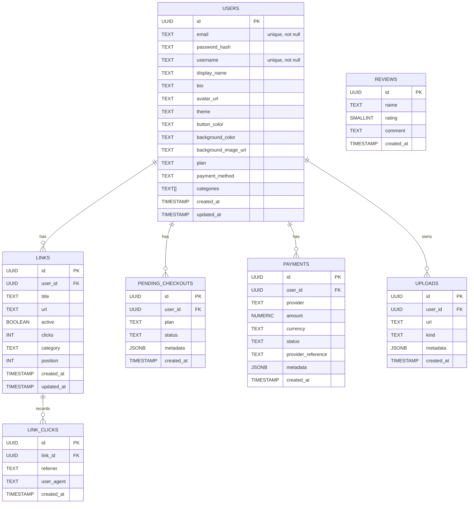

# Curvi — Modelo lógico de banco de dados (Postgres)

Este documento descreve o modelo lógico de banco de dados relacional necessário para suportar o frontend existente em `frontend/src`.

Resumo das entidades principais:
- `users` — contas de criadoras (perfil, personalização, plano)
- `links` — links que aparecem na página pública de cada usuária
- `link_clicks` — (opcional) eventos de clique para analytics
- `reviews` — avaliações públicas da plataforma
- `pending_checkouts` / `payments` — controle de checkout e pagamentos (integração)
- `uploads` — metadados de arquivos (avatares, fundos) quando usar storage externo

Decisões rápidas:
- As arrays de categorias por usuário podem ser armazenadas como `text[]` ou `jsonb` em `users.categories` para simplicidade.
- `links.clicks` contém o contador atual; a tabela `link_clicks` é opcional quando se quer histórico granular.
- Senhas devem ser armazenadas como `password_hash` (bcrypt/argon2). Nunca salvar senha em texto puro.

---

## Modelo lógico (tabelas e campos sugeridos)



### Exemplo de DDL (Postgres)

```sql
CREATE EXTENSION IF NOT EXISTS "pgcrypto";

CREATE TABLE users (
  id uuid PRIMARY KEY DEFAULT gen_random_uuid(),
  email text NOT NULL UNIQUE,
  password_hash text,
  username text NOT NULL UNIQUE,
  display_name text,
  bio text,
  avatar_url text,
  theme text,
  button_color text,
  background_color text,
  background_image_url text,
  plan text NOT NULL DEFAULT 'free',
  payment_method text,
  categories text[] DEFAULT ARRAY['Redes Sociais','Produtos','Conteúdo','Contato'],
  created_at timestamptz NOT NULL DEFAULT now(),
  updated_at timestamptz NOT NULL DEFAULT now()
);

CREATE TABLE links (
  id uuid PRIMARY KEY DEFAULT gen_random_uuid(),
  user_id uuid NOT NULL REFERENCES users(id) ON DELETE CASCADE,
  title text NOT NULL,
  url text NOT NULL,
  active boolean NOT NULL DEFAULT true,
  clicks integer NOT NULL DEFAULT 0,
  category text,
  position integer,
  created_at timestamptz NOT NULL DEFAULT now(),
  updated_at timestamptz NOT NULL DEFAULT now()
);

CREATE TABLE link_clicks (
  id uuid PRIMARY KEY DEFAULT gen_random_uuid(),
  link_id uuid NOT NULL REFERENCES links(id) ON DELETE CASCADE,
  referrer text,
  user_agent text,
  created_at timestamptz NOT NULL DEFAULT now()
);

CREATE TABLE reviews (
  id uuid PRIMARY KEY DEFAULT gen_random_uuid(),
  name text NOT NULL,
  rating smallint NOT NULL CHECK (rating >= 1 AND rating <= 5),
  comment text NOT NULL,
  created_at timestamptz NOT NULL DEFAULT now()
);

CREATE TABLE pending_checkouts (
  id uuid PRIMARY KEY DEFAULT gen_random_uuid(),
  user_id uuid NOT NULL REFERENCES users(id) ON DELETE CASCADE,
  plan text NOT NULL,
  status text NOT NULL DEFAULT 'pending',
  metadata jsonb,
  created_at timestamptz NOT NULL DEFAULT now()
);

CREATE TABLE payments (
  id uuid PRIMARY KEY DEFAULT gen_random_uuid(),
  user_id uuid REFERENCES users(id),
  provider text,
  amount numeric(10,2),
  currency text DEFAULT 'BRL',
  status text,
  provider_reference text,
  metadata jsonb,
  created_at timestamptz NOT NULL DEFAULT now()
);

CREATE TABLE uploads (
  id uuid PRIMARY KEY DEFAULT gen_random_uuid(),
  user_id uuid REFERENCES users(id),
  url text NOT NULL,
  kind text,
  metadata jsonb,
  created_at timestamptz NOT NULL DEFAULT now()
);

-- Índices úteis
CREATE INDEX idx_users_lower_username ON users (lower(username));
CREATE INDEX idx_links_user_id ON links (user_id);
CREATE INDEX idx_link_clicks_created_at ON link_clicks (created_at);
```

---

## Observações importantes sobre o modelo

- Segurança: salve `password_hash` com bcrypt/argon2; nunca armazene senhas em texto claro.
- Consistência: operações que incrementam contadores (ex.: `clicks`) devem ser atômicas: `UPDATE links SET clicks = clicks + 1 WHERE id = $1 RETURNING clicks`.
- Performance: mantenha o contador `links.clicks` para leituras rápidas; use `link_clicks` apenas se precisar de histórico para análises temporais.
- Retenção: logs de cliques podem crescer muito rápido — defina políticas de retenção/arquivamento.
- Backups e índices: indexe `lower(username)` para busca pública por username; crie índices adicionais conforme consultas reais.

---

Se quiser, eu gero migrations SQL ou um `schema.prisma` a partir deste modelo.
